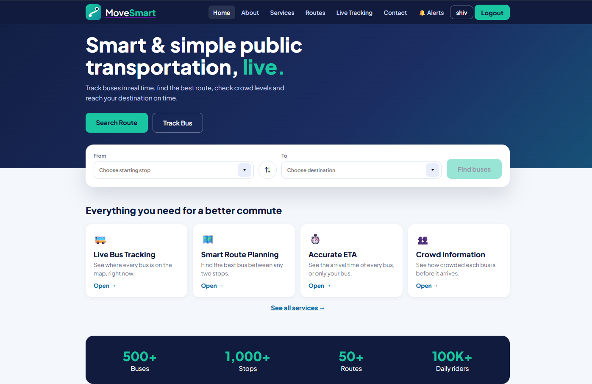
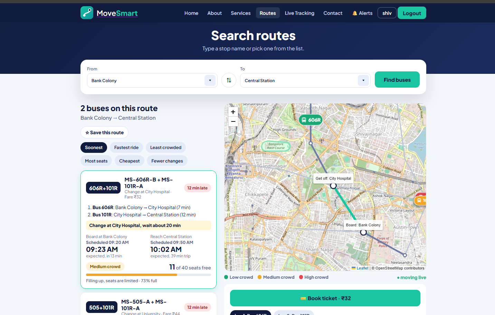
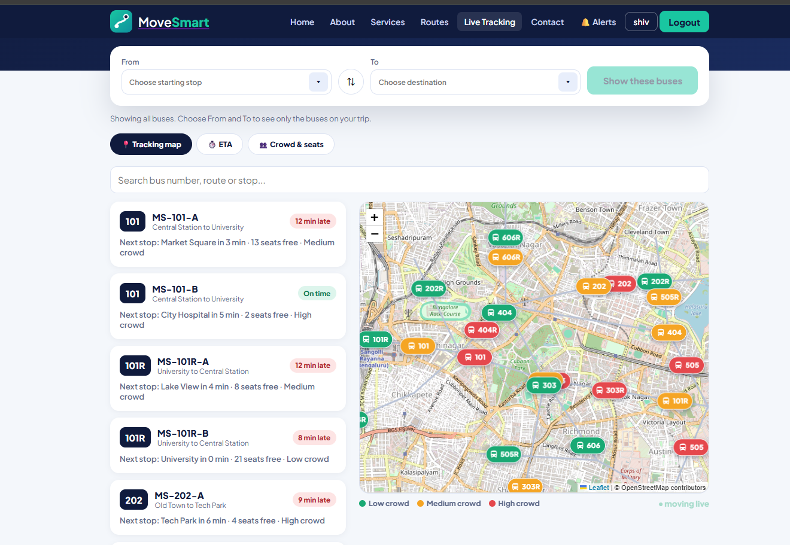
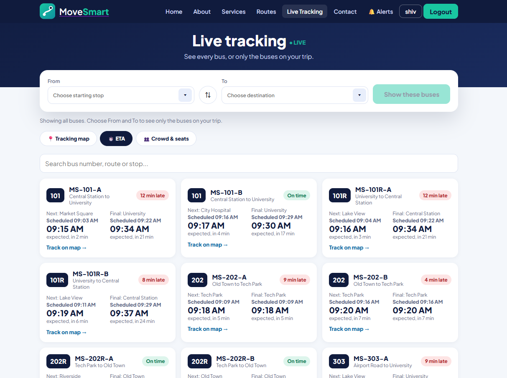
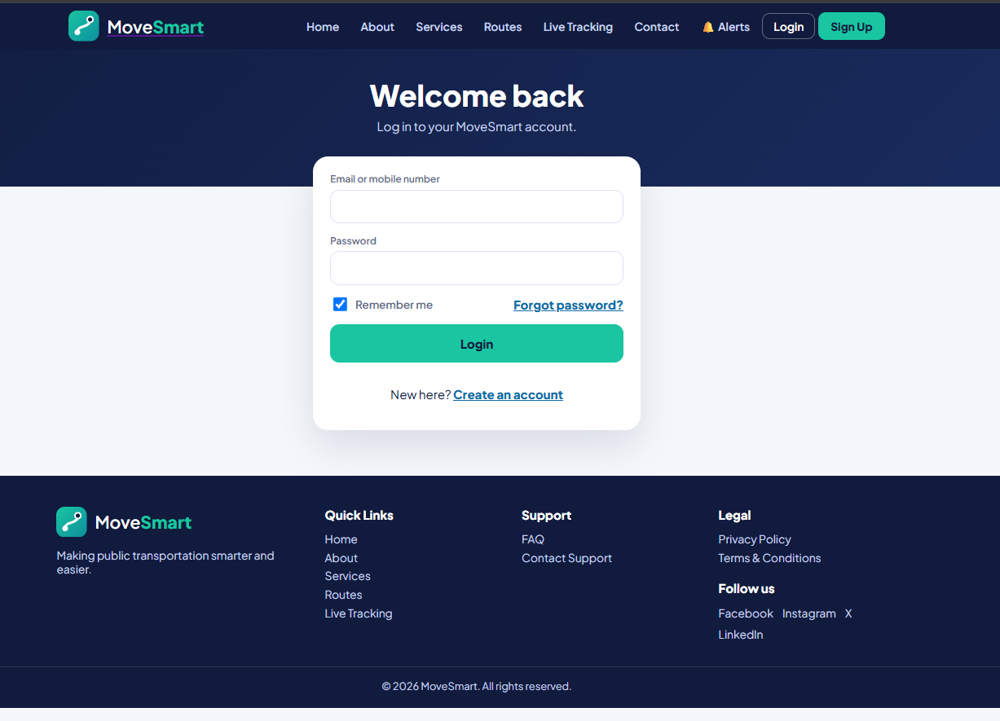
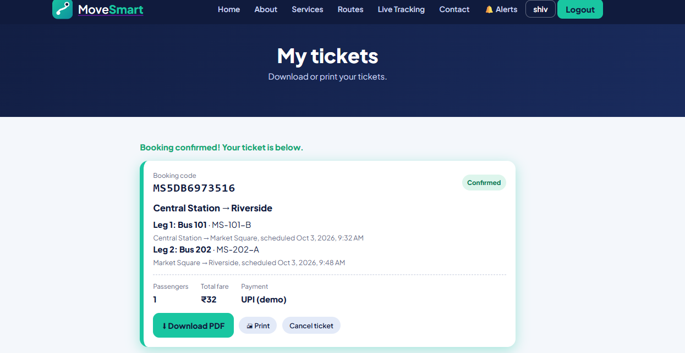
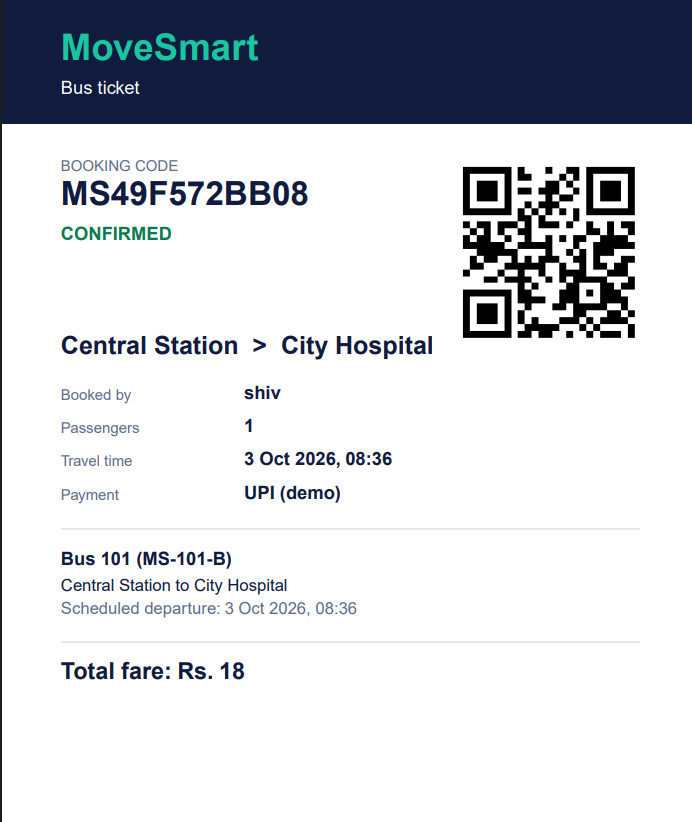

# 🚌 MoveSmart - Smart Public Transportation System

**MoveSmart** is a full-stack web-based public transportation system built with **React, Node.js, Express, and MySQL**. It helps passengers search for buses, check routes and ETA, track buses on a live map, view seat and crowd information, and book digital tickets with QR codes.

> **Note:** This is a project/demo build. Bus locations, crowd levels, delays, and payments are simulated for demonstration purposes.

---

## 📌 Features

* ✅ Search buses using **From and To** stops
* ✅ Live bus tracking using an interactive map
* ✅ Real-time style **ETA and delay information**
* ✅ Scheduled vs expected bus timings
* ✅ Check available seats and total seats
* ✅ View **Low / Medium / High** crowd levels
* ✅ Find direct buses and one-change routes
* ✅ Sort buses by time, fare, seats, crowd, and changes
* ✅ Book tickets for 1 to 6 passengers
* ✅ Demo payment system
* ✅ Generate and download tickets as PDF
* ✅ QR code included in digital tickets
* ✅ Cancel booked tickets
* ✅ User signup, login, logout and password reset
* ✅ Secure password hashing using bcrypt
* ✅ User dashboard with favorites and recent searches
* ✅ Delay and service notifications
* ✅ Responsive design for desktop, tablet and mobile
* ✅ About, Services, Contact, FAQ, Privacy Policy and Terms pages

---

## 🛠 Tech Stack

* **Frontend:** React 18, Vite, React Router
* **Backend:** Node.js, Express
* **Database:** MySQL
* **Maps:** Leaflet, React Leaflet, OpenStreetMap
* **Authentication:** bcryptjs, JWT, HTTP-only Cookies
* **Ticket:** PDFKit
* **QR Code:** QRCode
* **Development:** npm, MySQL Workbench

---

## 📸 Screenshots

### 🏠 Home Page


### 🚌 Bus Search / Routes Page


### 📍 Live Tracking Page


### 🕐 Bus Details / ETA Page


### 🔐 Login Page


### 🎫 Ticket Booking Page


### 🎟️ Digital Ticket


## 📁 Project Structure

```text
movesmart/
├── backend/
│   ├── server.js             # Express server and API routes
│   ├── transit.js            # Routes, timetable, ETA, crowd and fares
│   ├── tickets.js            # Ticket booking and PDF generation
│   ├── auth.js               # Authentication and password hashing
│   ├── utils.js              # Timetable and utility functions
│   ├── simulate.js           # Bus movement and demo data simulation
│   ├── db.js                 # MySQL database connection
│   └── .env.example          # Environment configuration
│
├── database/
│   └── schema.sql            # Database tables and sample data
│
├── frontend/
│   └── src/
│       ├── pages/             # Home, Routes, Live, Auth, Dashboard, etc.
│       ├── components/       # Header, Footer, Map, TripCard, Booking, etc.
│       ├── AuthContext.jsx   # Authentication state
│       ├── api.js            # API requests
│       ├── App.jsx           # Main application
│       ├── main.jsx          # React entry point
│       └── styles.css        # Application styling
│
├── docs/
│   ├── home.png              # Home page screenshot
│   ├── routes.png            # Bus search screenshot
│   ├── live.png              # Live tracking screenshot
│   ├── bus-details.png       # Bus details screenshot
│   ├── login.png             # Login screenshot
│   ├── dashboard.png         # Dashboard screenshot
│   ├── booking.png           # Booking screenshot
│   └── ticket.png            # Digital ticket screenshot
│
└── README.md
```

---

## 🚀 Installation

**Prerequisites:** Node.js LTS, MySQL Server, npm and Git installed.

```bash
# Clone the repository
git clone https://github.com/your-username/movesmart.git

# Open the project
cd movesmart

# Create the database using:
# database/schema.sql
```

### Backend Setup

```bash
cd backend

# Install dependencies
npm install

# Create .env from .env.example
copy .env.example .env

# Start backend
npm run dev
```

### Frontend Setup

Open another terminal:

```bash
cd frontend

# Install dependencies
npm install

# Start frontend
npm run dev
```

### Bus Simulation

Open another terminal:

```bash
cd backend
npm run simulate
```

Open the application at:

```text
http://localhost:5173
```

---

## 🖥 Usage Guide

1. Open the **MoveSmart Home Page**
2. Select your **From** and **To** stops
3. Click **Search**
4. View available buses and routes
5. Compare **ETA, fare, seats and crowd level**
6. Open **Live Tracking** to view buses on the map
7. Select your preferred bus
8. Choose the number of passengers
9. Select a demo payment method
10. Confirm the booking
11. Download or print the **PDF ticket with QR code**

---

## 🔍 Main Pages

### 1️⃣ Home Page

Provides the main introduction to MoveSmart and allows users to start searching for buses.

### 2️⃣ Routes Page

Displays available buses between the selected source and destination.

### 3️⃣ Live Tracking Page

Displays bus locations on an interactive map.

### 4️⃣ Login / Signup Page

Allows users to create accounts and securely log in.

### 5️⃣ Dashboard

Displays user profile, favorite routes, recent searches, alerts and tickets.

### 6️⃣ Ticket Booking Page

Allows passengers to select a bus, number of passengers and demo payment method.

### 7️⃣ Digital Ticket

Generates a PDF ticket containing journey information and a QR code.

---

## 📜 Example Bus Information

```text
Bus No: MS-101
Route: Pune Station → Swargate

Scheduled Time: 10:30 AM
Expected Time: 10:34 AM

Status: 4 min late

Seats: 18 / 40
Crowd Level: Medium

ETA: 8 minutes
Fare: ₹25
```

---

## 🧠 How It Works

* **React** provides the user interface and responsive pages.
* **Node.js and Express** handle the backend APIs.
* **MySQL** stores users, stops, routes, buses and ticket information.
* **Leaflet and OpenStreetMap** display buses on the map.
* The **simulation system** generates bus movement, passenger counts and delays.
* The **ETA system** calculates expected arrival times using the timetable and current delay.
* **PDFKit** generates downloadable tickets.
* **QRCode** generates QR codes for digital tickets.
* **bcryptjs and HTTP-only cookies** provide authentication and session security.

---

## 🧪 Testing

* Run the frontend and backend applications
* Test user signup and login
* Search different From and To stops
* Check direct and one-change routes
* Test live bus tracking
* Check ETA and delay information
* Check seat and crowd information
* Test ticket booking
* Download the generated PDF ticket
* Verify QR code generation
* Test ticket cancellation
* Test notifications and alerts
* Test the website on desktop and mobile screens

---

## 🚧 Future Improvements

* 📡 Connect real GPS devices for live bus tracking
* 💳 Integrate real payment gateways
* 📧 Add email/SMS notifications
* 🤖 Add AI-based crowd prediction
* 👨‍💼 Add an admin dashboard
* 📱 Develop Android/iOS mobile applications
* 🔔 Add push notifications
* 📊 Add transportation analytics
* 🗺️ Improve route optimization
* ☁️ Deploy the system to the cloud
* 🎫 Add monthly/seasonal travel passes

---

## 📜 License

This project is developed for **educational and academic purposes**.

---

## 👨‍💻 Author

Developed by **Shivram Aade** and Team as a **Smart Public Transportation System** project.

**MoveSmart - Search. Track. Travel.**
